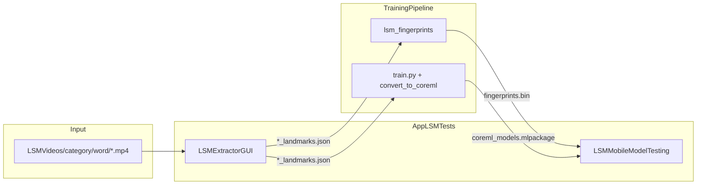

# AGENTS.md — TrainingPipeline

> **Audience:** AI-assisted and agentic development. For human onboarding, see [README.md](./README.md).
>
> **Sibling repo:** [AppLSMTests/AGENTS.md](../AppLSMTests/AGENTS.md) — macOS extractor + iOS inference (includes Xcode signing conventions).

This repo is the **Python side** of LSM (Lengua de Señas Mexicana): Fase 1 statistical fingerprint + DTW (`lsm_fingerprints/`) and Fase 2 neural training + Core ML export.

---

## Goals and success metrics

| Phase | Goal | Success metric |
|---|---|---|
| **Fase 1** | Recognize signs without training a neural net | ≥60% top-1 leave-one-out (minimum 40%); top-5 ≥70% (goal 85%) |
| **Fase 2** | Beat Fase 1 with deep learning | TCN/CNN accuracy > Fase 1 baseline on same dataset |
| **Mobile** | Real-time inference on iOS | Fase 1 latency <200ms (goal <100ms) |

**Vocabulary:** 221 words in `themes.json` (11 categories). Current trained model: ~187 classes (classes with ≥2 valid videos after `--min-videos` filter).

---

## Ecosystem architecture



**End-to-end flow:**

1. Organize raw videos (optional): `organize_from_json.py` + `themes.json`
2. Extract landmarks: LSMExtractorGUI → `LSMVideosOutput/` (see AppLSMTests)
3. Fase 1: `build_db.py` → `evaluate.py` → copy `fingerprints.bin` to iOS
4. Fase 2: `train.py` → `convert_to_coreml.py` → copy `.mlpackage` + `classes.json` to iOS
5. Test on device: LSMMobileModelTesting

---

## Critical invariants (do not break)

| Contract | Value / rule |
|---|---|
| Landmark vector | 135 dims/frame: `[0:42]` left hand, `[42:84]` right hand, `[84:135]` pose (17× x,y,visibility) |
| Sequence length | 85 frames after linear interpolation |
| JSON frame keys | `frame`, `timestamp_ms`, `leftHand`, `rightHand`, `pose`; Y=0 at top in stored JSON |
| Extractor input | `{root}/{category}/{word}/*.mp4` — folder path is source of truth |
| Extractor output | Mirrors input under separate output root + `dataset_manifest.json` |
| Training dataset | Nested `category/word/*_landmarks.json` or flat `word/*_landmarks.json` — see `dataset.py` |
| Fase 1 binary | `fingerprints.bin` magic `0x4C534D46`, version 1 — see `lsm_fingerprints/export_bin.py` |
| Fase 1 fingerprint | 810-dim, L2-normalized statistical fingerprint |

---

## File index — if task X, read Y

| Task | Files |
|---|---|
| Load / augment landmarks | `dataset.py` |
| Train model | `train.py`, `model.py`, `model_tcn.py`, `model_3dcnn.py` |
| Modular models (smoke tests) | `models/` (`__init__.py`, `cnn1d.py`, `tcn.py`, `cnn3d.py`) |
| Core ML export | `convert_to_coreml.py` |
| Organize raw videos | `organize_from_json.py`, `themes.json` |
| Vocabulary listing | `list_words.py`, `palabras.txt` |
| Fase 1 build DB | `lsm_fingerprints/build_db.py` |
| Fase 1 evaluate (LOO) | `lsm_fingerprints/evaluate.py` |
| Fase 1 matching | `lsm_fingerprints/matcher.py` |
| Fase 1 preprocessing | `lsm_fingerprints/preprocess.py` |
| Fase 1 fingerprint | `lsm_fingerprints/fingerprint.py` |
| Fase 1 constants | `lsm_fingerprints/constants.py` |
| Fase 1 ↔ Swift parity | `lsm_fingerprints/tests/test_all.py`, `lsm_fingerprints/tests/fixtures/golden_sequence.json` |
| Generate iOS sample bin | `lsm_fingerprints/generate_sample_bin.py` |
| Export golden fixtures | `lsm_fingerprints/export_fixtures.py` |
| Model smoke tests | `test_models_smoke.py` |
| Training configs | `configs/*.yaml` |

### Fase 1 module reference

| File | Role |
|---|---|
| `preprocess.py` | Shoulder anchor normalization, valid-frame filter, 85-frame interpolation |
| `fingerprint.py` | 810-dim L2-normalized statistical fingerprint |
| `build_db.py` | Index landmark JSON → `fingerprints.npz`; optional `.bin` export |
| `export_bin.py` | Write `fingerprints.bin` (magic `0x4C534D46`) for Swift |
| `matcher.py` | Cosine pre-filter + FastDTW + class voting |
| `evaluate.py` | Leave-one-out cross-validation |
| `constants.py` | Shared dims/thresholds — must stay in sync with Swift `LSMConstants.swift` |

---

## Technologies and dependencies

| Stack | Details |
|---|---|
| Python | 3.13+ recommended |
| ML | PyTorch 2.1+, torchvision, scipy, scikit-learn |
| Export | coremltools 7+ |
| Fase 1 | numpy, scipy, fastdtw |
| Logging | tensorboard |
| Config | pyyaml |

See `requirements.txt` and `lsm_fingerprints/requirements.txt`.

**Dev environment:** shared venv at `TrainingPipeline/.venv`. Fase 1 tests:

```bash
cd lsm_fingerprints
PYTHONPATH="../.venv/lib/python3.13/site-packages:." python tests/test_all.py
```

---

## Common workflows

### Build Fase 1 database

```bash
cd lsm_fingerprints
python build_db.py \
  --dataset ../output \
  --output ./fingerprints.npz \
  --export-bin ./fingerprints.bin
```

### Evaluate Fase 1 (leave-one-out)

```bash
cd lsm_fingerprints
python evaluate.py --db ./fingerprints.npz
```

### Add Fase 1 class (no retraining)

```bash
cd lsm_fingerprints
python -c "
from build_db import add_class
from preprocess import prepare_sequence
seq = prepare_sequence(json_path='nueva_seña_landmarks.json')
add_class('./fingerprints.npz', 'NuevaPalabra', [seq], category='Familia',
          export_bin_path='./fingerprints.bin')
"
```

Copy resulting `fingerprints.bin` to LSMMobileModelTesting Xcode target.

### Train Fase 2

```bash
python train.py --dataset ./output --model tcn --epochs 100 --batch 64 --output ./runs
```

### Export Core ML

```bash
python convert_to_coreml.py --checkpoint ./runs/best_model.pt --output ./lsm_model
```

### Organize videos from themes.json

```bash
python organize_from_json.py --json themes.json --input ./videos --output ./dataset
```

### Run tests

```bash
python test_models_smoke.py
cd lsm_fingerprints && python tests/test_all.py
```

---

## Phase 1 testing workflow (LSMOutput)

**Dataset:** `../LSMOutput` (2,131 landmark JSON, 14 categories, 501 words in manifest).

```bash
export DATASET=/path/to/LSMOutput
export PYTHONPATH=".venv/lib/python3.13/site-packages:lsm_fingerprints:."
cd lsm_fingerprints

python tests/test_all.py
python build_db.py --dataset "$DATASET/Colores" --output ./runs_pilot/colores_fingerprints.npz --min-videos 1
python evaluate.py --db ./runs_pilot/colores_fingerprints.npz
python build_db.py --dataset "$DATASET/Familia" --output ./runs_pilot/familia_fingerprints.npz
python evaluate.py --db ./runs_pilot/familia_fingerprints.npz
python build_db.py --dataset "$DATASET" --output ./fingerprints.npz --export-bin ./fingerprints.bin --min-videos 2
python evaluate.py --db ./fingerprints.npz 2>&1 | tee loo_report.log
```

**Local artifacts** (gitignored): `fingerprints.npz`, `fingerprints.bin`, `loo_report.log`, `runs_pilot/`.

---

## Phase 1 baseline (LSMOutput)

Measured **2026-06-17** on full LSMOutput extract.

| Metric | Result | Target |
|---|---|---|
| Classes indexed | 307 | — |
| Videos indexed | 1,934 | — |
| Build skipped | 3 | — |
| **Top-1 LOO** | **6.57%** | ≥40% (goal 60%) |
| **Top-5 LOO** | **16.18%** | ≥70% (goal 85%) |

**Pilots:**

| Subset | Classes | Videos | Top-1 | Top-5 |
|---|---|---|---|---|
| Colores | 2 | 12 | 25.00% | 100.00% |
| Familia | 21 | 126 | 11.11% | 31.75% |

**Per-category Top-1 (full LOO):** Festividades 24.4%, Personajes_Historicos 17.3%, Frutas_Verduras_y_Plantas 11.1%, Personas 10.9%, Colores 8.3%, Profesiones 7.9%, Alimentos_y_Bebidas 6.9%, Familia 4.0%, Animales_e_Insectos 3.8%, Locaciones 2.3%, Abecedario 2.1%, Objetos 2.0%, Actividades_Cotidianas 0.0%.

**Conclusion:** baseline not met; investigate preprocessing, class confusion (Abecedario), and Fase 2 as alternative before iOS field validation.

---

## iOS validation results

Integration work in AppLSMTests (**2026-06-06**). Device camera tests still pending on Mac.

| Check | Result | Notes |
|---|---|---|
| Bin bundled locally | Pass | ~95 MB, magic `LSMF`, 307 classes, 1934 videos |
| Bin parse (offline) | Pass | ~0.1 s load on Linux |
| Golden fingerprint parity | Pass | max diff 0.0 vs `golden_sequence.json` (Python); Swift Debug check pending Mac |
| Async bin load + loading UI | Implemented | `LandmarkPipeline.loadModel` |
| Background inference + DTW radius | Implemented | `dtwRadius=10`; match on detached queue |
| Live Top-1 / confidence | **Pending device** | Expect weak matches given 6.57% LOO |
| Inference latency (device) | **Pending device** | Python desktop reference ~930 ms/cycle (FastDTW r=10) |
| Release build smoke | **Pending device** | Parity skipped in Release (`#if DEBUG`) |

Full checklist: [AppLSMTests/AGENTS.md — Phase 1 iOS validation](../AppLSMTests/AGENTS.md#phase-1-ios-validation-checklist)

---

## Handoff to AppLSMTests

After `fingerprints.bin` is built locally, iOS validation is owned by AppLSMTests:

1. Copy production `fingerprints.bin` to LSMMobileModelTesting bundle
2. Debug build — `Phase1ParityCheck` against `golden_sequence.json`
3. Live Fase 1 smoke test (5–10 known signs from 307-class DB)
4. Latency check via debug panel (<200ms target)

Full checklist: [AppLSMTests/AGENTS.md — Phase 1 iOS validation](../AppLSMTests/AGENTS.md#phase-1-ios-validation-checklist)

---

## Next steps / backlog

1. **Device validation (AppLSMTests):** Debug console parity, live matrix, latency, Release smoke — integration code ready
2. Improve Fase 1 accuracy (preprocessing tuning, category-scoped DBs, Abecedario isolation) or proceed to Fase 2 TCN
3. Validate Fase 2 TCN beats Fase 1 once Fase 1 baseline improves or Fase 2 is trained on LSMOutput
4. Close vocab gap: 501 words extracted vs 307 classes with ≥2 valid videos
5. Optional: `build_db.py --manifest`, manifest → `themes.json` converter
6. Resolve dual model paths: root `model*.py` (used by `train.py`) vs `models/` package (smoke tests only)

---

## Agent conventions

### Do

- Match existing naming and conventions; keep diffs minimal and focused
- Reuse `dataset.py` vector layout; keep Fase 1 Python/Swift constants in sync
- Update AGENTS.md and README.md when changing contracts, workflows, or backlog
- Check sibling [AppLSMTests/AGENTS.md](../AppLSMTests/AGENTS.md) for cross-repo changes

### Don't

- Commit `.venv/`, `runs/*.pt`, `dataset/`, `fingerprints.npz`, `fingerprints.bin` (gitignored artifacts)
- Reintroduce `themes.json` filename matching in the extractor — path-based discovery is canonical (AppLSMTests)
- Create new `.md` files — only `README.md` and `AGENTS.md` are tracked (see `.gitignore`)
- Modify Xcode signing settings — see AppLSMTests AGENTS.md for iOS/macOS work

---

## Documentation maintenance protocol

After completing a task that changes architecture, contracts, workflows, or backlog status:

1. Update **this repo's** `AGENTS.md`
2. Update **this repo's** `README.md` if human-facing behavior changed
3. Check whether [AppLSMTests/AGENTS.md](../AppLSMTests/AGENTS.md) needs the same invariant or cross-link update
4. Do **not** add other markdown files

| Change type | Update |
|---|---|
| New module / renamed file | File index in both AGENTS.md; structure in repo README |
| Data contract change | Invariants in both AGENTS.md; examples in both READMEs |
| New CLI flag or workflow | Commands here; workflow in README |
| Completed backlog item | Remove or mark done in both AGENTS.md |
| Cross-repo integration | Ecosystem diagram + sibling cross-link in both files |
